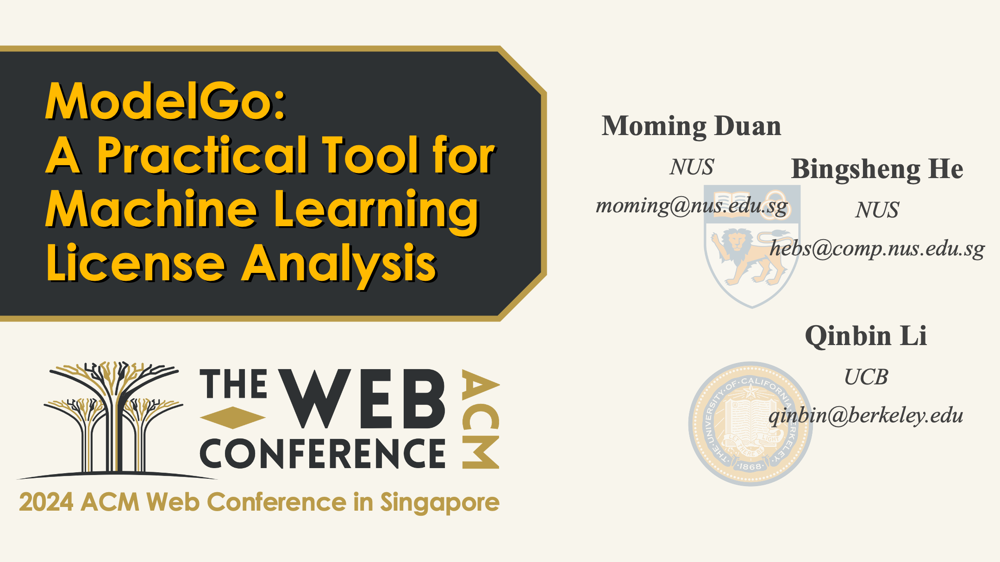
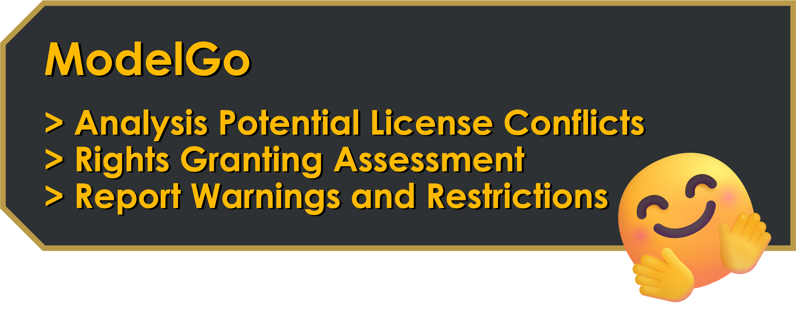
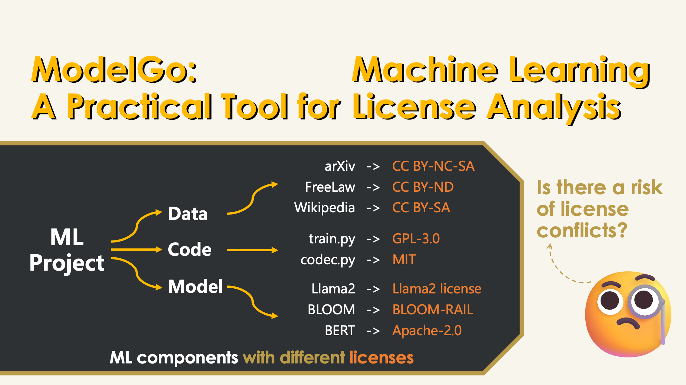
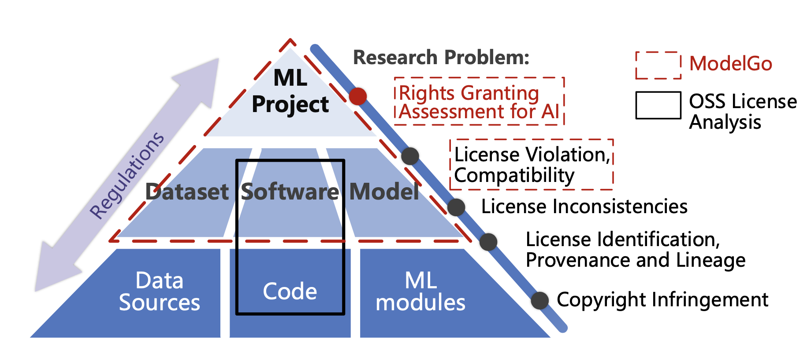
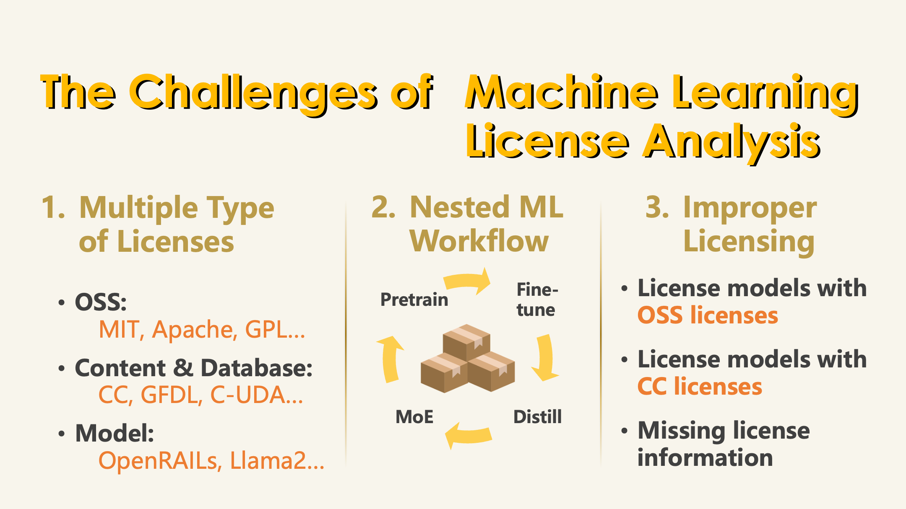
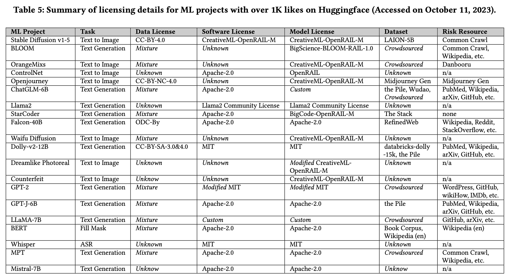
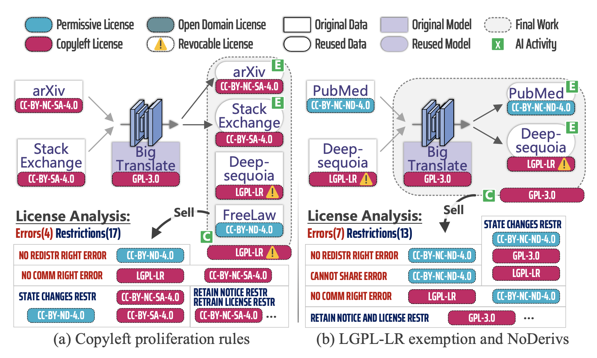

# ModelGo

### Official impletementation of ACM TheWebConf2024 accepted Oral Paper:
### ModelGo: A Practical Tool for Machine Learning License Analysis



📌 [Download this Paper](https://dl.acm.org/doi/abs/10.1145/3589334.3645520)

# ModelGo Licenses Set
### ✨Recent Update: We are happy to announce our [ModelGo Licenses Set V2.0](https://www.modelgo.li)! 🤗
#### ModelGo Licenses provide flexible, free, and user-friendly licensing solutions to meet your specific needs in publishing deep learning models. We offer you multiple publishing options (similar to Creative Commons):


* **BY** - Downstream model users must give credit to you, retain your attribution information, keep the original license and notice in their shared copies and modifications.
* **NC** - Downstream model users must run and distribute your models, derivatives of your models, and generated content of your models for Non-Commercial purposes only.
* **ND** - Downstream model users may Not Distribute any modified works or extracted models based on your models (but can create and use them privately).
* **SA** - Downstream model users must keep their distributed derivatives ShareAlike by applying the same license to their derivative work when publishing (Copyleft).
* **RAI** - Downstream model users must ensure that their use and distribution of your models and derivatives of your models comply with the terms of Responsible use of AI (14 prohibited uses).

#### Why we need ModelGo Licenses Set?
> To facilitate managed sharing of models while protecting your Intellectual Property. ModelGo licenses offer flexible options to fulfill your specific licensing needs about using and distributing your deep learning models while protecting your Intellectual Property (IP). Traditional open-source software (OSS) licenses lack clear definitions regarding machine learning concepts, such as Models, Output, and Derivatives created through knowledge transfer. This lack of compatibility can result in certain ML activities (e.g., Distillation, Mix-of-Expert) being beyond the control of the model owner and potentially compromising their IP rights.

Please visit our website for the full text of the ModelGo Licenses Set and more information.

💡 *Note: The ModelGo Licenses Set is a set of licenses (Terms & Conditions) designed for ML models for the purpose of standardized model licensing (We just reuses the name ModelGo).*

## Overview 

ModelGo is a a specialized parser designed for license analysis in **Mahine Learning Project**. It mainly provides three features currently:



The struct of ModelGo:
```
.
├── license_raw # Raw text of ModelGo's supported licenses
│   ├── AFL-3.0.txt
│   ├── AGPL-3.0.txt
│   └── ...
├── paper_list # References of ModelGo
│   └── ...
├── tex # LaTex file of ModelGo
│   ├── MAIN.pdf # Latest version of this work
│   └── ...
├── License_parser.py # Define 'License' and implement conflict analysis function
├── licenses_description.yml # Standardized license terms
├── reuse_methods.py # Define the dependency rules for different model reusing methods
├── main.py # Provided use cases
├── works.py # Define 'Work' and its dependencies structure
└── README.md
```

## How to Use 
For the use cases demonstrated in the paper, you can run the corresponding code in main.py to observe the analysis results. 
For a new use case, you should define your `Work` variable and `license` variable (if the used license is not in `licenses_description.yml`, you also need to update this file) model-reusing workflow, similar to what is done in `main.py`.


## Why We Need ModelGo 🤔


In a ML project, there are typically three main components: data, code, and model. Each of these components is governed by distinct licenses. For instance, an article from arXiv might be licensed under CC BY-NC-SA, while content from Wikipedia could be under CC BY-SA. Similarly, the modeling code and the model itself may have different licenses.
**Therefore, traditional OSS license analysis, which only considers code dependency, will fail in the ML project situation**.

#### ModelGo vs. Previous Work:


## Unique Challenges in License Analysis for ML Projects 😥


There are three challenges we need consider when we design ModelGo:
1. ML projects may involve multiple types of licenses. For instance, the modeling code may be licensed as software, while the training dataset may be governed under content or database licensing frameworks like Creative Commons. Particularly challenging are the newly introduced responsible AI licenses such as OpenRAIL and Llama2, which are not supported by traditional license analysis applications.
Addressing multiple licensing frameworks in a single license analysis application poses a significant challenge.

2. ML workflows can be nested, involving multiple rounds of reuse. For instance, we may fine-tune a pretrained model with additional data and then distill the tuned model using another set of data. This intricate reuse flowchart establishes a complex dependency relationship among ML components, presenting a unique challenge for license analysis.

3. The prevalence of improper licensing in current ML projects. Due to a lack of consensus in licensing, many models opt for software licenses or content licenses that simply match their code or dataset, which is not suitable for the ML scenario. It becomes challenging to find matching terms for ML activities such as training and distillation. Additionally, many ML projects do not declare license information, further increasing the ambiguity for license analysis.

You can find evidence from our summary table:


## Example



#### Cite this Work:
```
@inproceedings{duan2024modelgo,
  title={{ModelGo}: A Practical Tool for Machine Learning License Analysis},
  author={Duan, Moming and Li, Qinbin and He, Bingsheng},
  booktitle={Proceedings of the {ACM} Web Conference 2024},
  doi={10.1145/3589334.3645520},
  pages={1158–1169},
  year={2024}
}
```
