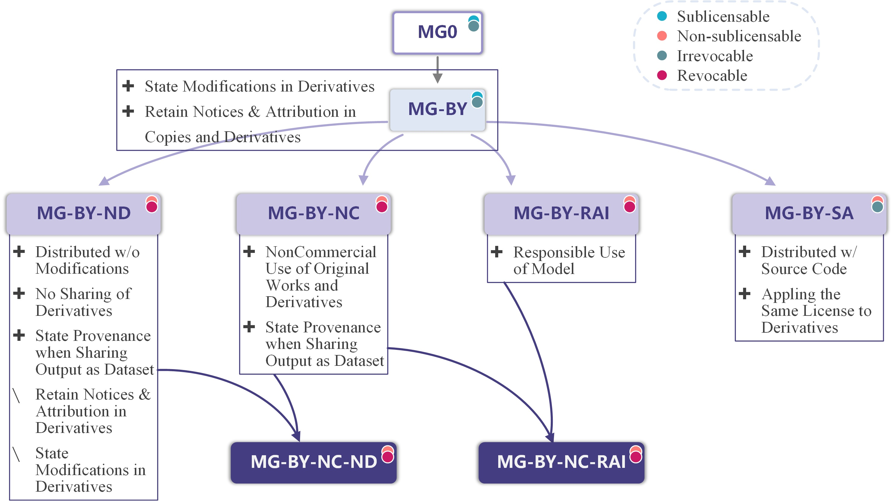

# ✨ How to Choose

## 📋 With the Help of Model Sheet

Agreeing with [IBM AI Factsheet](https://aifs360.res.ibm.com) and [Montreal Data License](https://arxiv.org/abs/1903.12262),  we believe that transparency is crucial to increasing trust and standardization in AI. ModelGo licenses use a <mark style="color:purple;">**Model Sheet**</mark> to assist model users in understanding the granted rights and restrictions in the license terms. It also helps model developers find the most suitable MG licenses.

We also recommend providing the Model Sheet to help downstream users better understand and comply with the license requirements.

Model Sheet:

<details>

<summary>MG0-2.0</summary>

````
### Model Sheet MG0-2.0
```
+--------------+-------------------------------------------------+---+
|              | Use, Reproduce, Distribute Licensed Materials   | ✓ |
|              +-------------------------------------------------+---+
|              | Create Derivative Materials                     | ✓ |
|              +-------------------------------------------------+---+
|              | Distribute Derivative Materials                 | ✓ |
| Grant of     +-------------------------------------------------+---+
| Rights       | Sublicensable License                           | ✓ |
|              +-------------------------------------------------+---+
|              | Revocable License                               | ✗ |
|              +-------------------------------------------------+---+
|              | Commercial Use of Licensed Materials            | ✓ |
|              | and/or Derivative Materials                     |   |
+--------------+-------------------------------------------------+---+
| Responsible  | Use Restrictions (RAI) on Licensed Materials    | ✗ |
| AI           | and Derivative Materials                        |   |
+--------------+-------------------------------------------------+---+
|              | Provide a Copy of Original License when         | ✗ |
|              | Distributing Licensed Materials                 |   |
|              +-------------------------------------------------+---+
|              | Provide a Copy of Original License when         | ✗ |
|              | Distributing Derivative Materials               |   |
|              +-------------------------------------------------+---+
|              | Retain Original Attribution Notice when         | ✗ |
| Requirements | Distributing Licensed Materials                 |   |
| Relating to  +-------------------------------------------------+---+
| Distribution | Retain Original Attribution Notice when         | ✗ |
| of Licensed  | Distributing Derivative Materials               |   |
| Materials,   +-------------------------------------------------+---+
| Derivative   | Indicate Modifications when Distributing        | ✗ |
| Materials,   | Derivative Materials                            |   |
| Output       +-------------------------------------------------+---+
|              | Disclosure of Distributed Licensed Materials    | ✗ |
|              | and/or Derivative Materials in Source Code Form |   |
|              +-------------------------------------------------+---+
|              | Licensing Distributed Derivative Materials      | ✗ |
|              | on Same Terms as License                        |   |
|              +-------------------------------------------------+---+
|              | Include a Notice of Provenance when             | ✗ |
|              | Distributing Output as Dataset                  |   |
+--------------+-------------------------------------------------+---+
```
````

</details>

<details>

<summary>MG-BY-2.0</summary>

````
### Model Sheet MG-BY-2.0
```
+--------------+-------------------------------------------------+---+
|              | Use, Reproduce, Distribute Licensed Materials   | ✓ |
|              +-------------------------------------------------+---+
|              | Create Derivative Materials                     | ✓ |
|              +-------------------------------------------------+---+
|              | Distribute Derivative Materials                 | ✓ |
| Grant of     +-------------------------------------------------+---+
| Rights       | Sublicensable License                           | ✓ |
|              +-------------------------------------------------+---+
|              | Revocable License                               | ✗ |
|              +-------------------------------------------------+---+
|              | Commercial Use of Licensed Materials            | ✓ |
|              | and/or Derivative Materials                     |   |
+--------------+-------------------------------------------------+---+
| Responsible  | Use Restrictions (RAI) on Licensed Materials    | ✗ |
| AI           | and Derivative Materials                        |   |
+--------------+-------------------------------------------------+---+
|              | Provide a Copy of Original License when         | ✓ |
|              | Distributing Licensed Materials                 |   |
|              +-------------------------------------------------+---+
|              | Provide a Copy of Original License when         | ✓ |
|              | Distributing Derivative Materials               |   |
|              +-------------------------------------------------+---+
|              | Retain Original Attribution Notice when         | ✓ |
| Requirements | Distributing Licensed Materials                 |   |
| Relating to  +-------------------------------------------------+---+
| Distribution | Retain Original Attribution Notice when         | ✓ |
| of Licensed  | Distributing Derivative Materials               |   |
| Materials,   +-------------------------------------------------+---+
| Derivative   | Indicate Modifications when Distributing        | ✓ |
| Materials,   | Derivative Materials                            |   |
| Output       +-------------------------------------------------+---+
|              | Disclosure of Distributed Licensed Materials    | ✗ |
|              | and/or Derivative Materials in Source Code Form |   |
|              +-------------------------------------------------+---+
|              | Licensing Distributed Derivative Materials      | ✗ |
|              | on Same Terms as License                        |   |
|              +-------------------------------------------------+---+
|              | Include a Notice of Provenance when             | ✗ |
|              | Distributing Output as Dataset                  |   |
+--------------+-------------------------------------------------+---+
```
````

</details>

<details>

<summary>MG-BY-SA-2.0</summary>

````
### Model Sheet MG-BY-SA-2.0
```
+--------------+-------------------------------------------------+---+
|              | Use, Reproduce, Distribute Licensed Materials   | ✓ |
|              +-------------------------------------------------+---+
|              | Create Derivative Materials                     | ✓ |
|              +-------------------------------------------------+---+
|              | Distribute Derivative Materials                 | ✓ |
| Grant of     +-------------------------------------------------+---+
| Rights       | Sublicensable License                           | ✗ |
|              +-------------------------------------------------+---+
|              | Revocable License                               | ✗ |
|              +-------------------------------------------------+---+
|              | Commercial Use of Licensed Materials            | ✓ |
|              | and/or Derivative Materials                     |   |
+--------------+-------------------------------------------------+---+
| Responsible  | Use Restrictions (RAI) on Licensed Materials    | ✗ |
| AI           | and Derivative Materials                        |   |
+--------------+-------------------------------------------------+---+
|              | Provide a Copy of Original License when         | ✓ |
|              | Distributing Licensed Materials                 |   |
|              +-------------------------------------------------+---+
|              | Provide a Copy of Original License when         | ✓ |
|              | Distributing Derivative Materials               |   |
|              +-------------------------------------------------+---+
|              | Retain Original Attribution Notice when         | ✓ |
| Requirements | Distributing Licensed Materials                 |   |
| Relating to  +-------------------------------------------------+---+
| Distribution | Retain Original Attribution Notice when         | ✓ |
| of Licensed  | Distributing Derivative Materials               |   |
| Materials,   +-------------------------------------------------+---+
| Derivative   | Indicate Modifications when Distributing        | ✓ |
| Materials,   | Derivative Materials                            |   |
| Output       +-------------------------------------------------+---+
|              | Disclosure of Distributed Licensed Materials    | ✓ |
|              | and/or Derivative Materials in Source Code Form |   |
|              +-------------------------------------------------+---+
|              | Licensing Distributed Derivative Materials      | ✓ |
|              | on Same Terms as License                        |   |
|              +-------------------------------------------------+---+
|              | Include a Notice of Provenance when             | ✗ |
|              | Distributing Output as Dataset                  |   |
+--------------+-------------------------------------------------+---+
```
````

</details>

<details>

<summary>MG-BY-RAI-2.0</summary>

````
### Model Sheet MG-BY-RAI-2.0
```
+--------------+-------------------------------------------------+---+
|              | Use, Reproduce, Distribute Licensed Materials   | ✓ |
|              +-------------------------------------------------+---+
|              | Create Derivative Materials                     | ✓ |
|              +-------------------------------------------------+---+
|              | Distribute Derivative Materials                 | ✓ |
| Grant of     +-------------------------------------------------+---+
| Rights       | Sublicensable License                           | ✗ |
|              +-------------------------------------------------+---+
|              | Revocable License                               | ✓ |
|              +-------------------------------------------------+---+
|              | Commercial Use of Licensed Materials            | ✓ |
|              | and/or Derivative Materials                     |   |
+--------------+-------------------------------------------------+---+
| Responsible  | Use Restrictions (RAI) on Licensed Materials    | ✓ |
| AI           | and Derivative Materials                        |   |
+--------------+-------------------------------------------------+---+
|              | Provide a Copy of Original License when         | ✓ |
|              | Distributing Licensed Materials                 |   |
|              +-------------------------------------------------+---+
|              | Provide a Copy of Original License when         | ✓ |
|              | Distributing Derivative Materials               |   |
|              +-------------------------------------------------+---+
|              | Retain Original Attribution Notice when         | ✓ |
| Requirements | Distributing Licensed Materials                 |   |
| Relating to  +-------------------------------------------------+---+
| Distribution | Retain Original Attribution Notice when         | ✓ |
| of Licensed  | Distributing Derivative Materials               |   |
| Materials,   +-------------------------------------------------+---+
| Derivative   | Indicate Modifications when Distributing        | ✓ |
| Materials,   | Derivative Materials                            |   |
| Output       +-------------------------------------------------+---+
|              | Disclosure of Distributed Licensed Materials    | ✗ |
|              | and/or Derivative Materials in Source Code Form |   |
|              +-------------------------------------------------+---+
|              | Licensing Distributed Derivative Materials      | ✗ |
|              | on Same Terms as License                        |   |
|              +-------------------------------------------------+---+
|              | Include a Notice of Provenance when             | ✗ |
|              | Distributing Output as Dataset                  |   |
+--------------+-------------------------------------------------+---+
```
````

</details>

<details>

<summary>MG-BY-NC-2.0</summary>

````
### Model Sheet MG-BY-NC-2.0
```
+--------------+-------------------------------------------------+---+
|              | Use, Reproduce, Distribute Licensed Materials   | ✓ |
|              +-------------------------------------------------+---+
|              | Create Derivative Materials                     | ✓ |
|              +-------------------------------------------------+---+
|              | Distribute Derivative Materials                 | ✓ |
| Grant of     +-------------------------------------------------+---+
| Rights       | Sublicensable License                           | ✗ |
|              +-------------------------------------------------+---+
|              | Revocable License                               | ✓ |
|              +-------------------------------------------------+---+
|              | Commercial Use of Licensed Materials            | ✗ |
|              | and/or Derivative Materials                     |   |
+--------------+-------------------------------------------------+---+
| Responsible  | Use Restrictions (RAI) on Licensed Materials    | ✗ |
| AI           | and Derivative Materials                        |   |
+--------------+-------------------------------------------------+---+
|              | Provide a Copy of Original License when         | ✓ |
|              | Distributing Licensed Materials                 |   |
|              +-------------------------------------------------+---+
|              | Provide a Copy of Original License when         | ✓ |
|              | Distributing Derivative Materials               |   |
|              +-------------------------------------------------+---+
|              | Retain Original Attribution Notice when         | ✓ |
| Requirements | Distributing Licensed Materials                 |   |
| Relating to  +-------------------------------------------------+---+
| Distribution | Retain Original Attribution Notice when         | ✓ |
| of Licensed  | Distributing Derivative Materials               |   |
| Materials,   +-------------------------------------------------+---+
| Derivative   | Indicate Modifications when Distributing        | ✓ |
| Materials,   | Derivative Materials                            |   |
| Output       +-------------------------------------------------+---+
|              | Disclosure of Distributed Licensed Materials    | ✗ |
|              | and/or Derivative Materials in Source Code Form |   |
|              +-------------------------------------------------+---+
|              | Licensing Distributed Derivative Materials      | ✗ |
|              | on Same Terms as License                        |   |
|              +-------------------------------------------------+---+
|              | Include a Notice of Provenance when             | ✓ |
|              | Distributing Output as Dataset                  |   |
+--------------+-------------------------------------------------+---+
```
````

</details>

<details>

<summary>MG-BY-NC-RAI-2.0</summary>

````
### Model Sheet MG-BY-NC-RAI-2.0
```
+--------------+-------------------------------------------------+---+
|              | Use, Reproduce, Distribute Licensed Materials   | ✓ |
|              +-------------------------------------------------+---+
|              | Create Derivative Materials                     | ✓ |
|              +-------------------------------------------------+---+
|              | Distribute Derivative Materials                 | ✓ |
| Grant of     +-------------------------------------------------+---+
| Rights       | Sublicensable License                           | ✗ |
|              +-------------------------------------------------+---+
|              | Revocable License                               | ✓ |
|              +-------------------------------------------------+---+
|              | Commercial Use of Licensed Materials            | ✗ |
|              | and/or Derivative Materials                     |   |
+--------------+-------------------------------------------------+---+
| Responsible  | Use Restrictions (RAI) on Licensed Materials    | ✓ |
| AI           | and Derivative Materials                        |   |
+--------------+-------------------------------------------------+---+
|              | Provide a Copy of Original License when         | ✓ |
|              | Distributing Licensed Materials                 |   |
|              +-------------------------------------------------+---+
|              | Provide a Copy of Original License when         | ✓ |
|              | Distributing Derivative Materials               |   |
|              +-------------------------------------------------+---+
|              | Retain Original Attribution Notice when         | ✓ |
| Requirements | Distributing Licensed Materials                 |   |
| Relating to  +-------------------------------------------------+---+
| Distribution | Retain Original Attribution Notice when         | ✓ |
| of Licensed  | Distributing Derivative Materials               |   |
| Materials,   +-------------------------------------------------+---+
| Derivative   | Indicate Modifications when Distributing        | ✓ |
| Materials,   | Derivative Materials                            |   |
| Output       +-------------------------------------------------+---+
|              | Disclosure of Distributed Licensed Materials    | ✗ |
|              | and/or Derivative Materials in Source Code Form |   |
|              +-------------------------------------------------+---+
|              | Licensing Distributed Derivative Materials      | ✗ |
|              | on Same Terms as License                        |   |
|              +-------------------------------------------------+---+
|              | Include a Notice of Provenance when             | ✓ |
|              | Distributing Output as Dataset                  |   |
+--------------+-------------------------------------------------+---+
```
````

</details>

<details>

<summary>MG-BY-ND-2.0</summary>

````
### Model Sheet MG-BY-ND-2.0
```
+--------------+-------------------------------------------------+---+
|              | Use, Reproduce, Distribute Licensed Materials   | ✓ |
|              +-------------------------------------------------+---+
|              | Create Derivative Materials                     | ✓ |
|              +-------------------------------------------------+---+
|              | Distribute Derivative Materials                 | ✗ |
| Grant of     +-------------------------------------------------+---+
| Rights       | Sublicensable License                           | ✗ |
|              +-------------------------------------------------+---+
|              | Revocable License                               | ✓ |
|              +-------------------------------------------------+---+
|              | Commercial Use of Licensed Materials            | ✓ |
|              | and/or Derivative Materials                     |   |
+--------------+-------------------------------------------------+---+
| Responsible  | Use Restrictions (RAI) on Licensed Materials    | ✗ |
| AI           | and Derivative Materials                        |   |
+--------------+-------------------------------------------------+---+
|              | Provide a Copy of Original License when         | ✓ |
|              | Distributing Licensed Materials                 |   |
|              +-------------------------------------------------+---+
|              | Provide a Copy of Original License when         | ✗ |
|              | Distributing Derivative Materials               |   |
|              +-------------------------------------------------+---+
|              | Retain Original Attribution Notice when         | ✓ |
| Requirements | Distributing Licensed Materials                 |   |
| Relating to  +-------------------------------------------------+---+
| Distribution | Retain Original Attribution Notice when         | ✗ |
| of Licensed  | Distributing Derivative Materials               |   |
| Materials,   +-------------------------------------------------+---+
| Derivative   | Indicate Modifications when Distributing        | ✗ |
| Materials,   | Derivative Materials                            |   |
| Output       +-------------------------------------------------+---+
|              | Disclosure of Distributed Licensed Materials    | ✗ |
|              | and/or Derivative Materials in Source Code Form |   |
|              +-------------------------------------------------+---+
|              | Licensing Distributed Derivative Materials      | ✗ |
|              | on Same Terms as License                        |   |
|              +-------------------------------------------------+---+
|              | Include a Notice of Provenance when             | ✓ |
|              | Distributing Output as Dataset                  |   |
+--------------+-------------------------------------------------+---+
```
````

</details>

<details>

<summary>MG-BY-NC-ND-2.0</summary>

````
### Model Sheet MG-BY-NC-ND-2.0
```
+--------------+-------------------------------------------------+---+
|              | Use, Reproduce, Distribute Licensed Materials   | ✓ |
|              +-------------------------------------------------+---+
|              | Create Derivative Materials                     | ✓ |
|              +-------------------------------------------------+---+
|              | Distribute Derivative Materials                 | ✗ |
| Grant of     +-------------------------------------------------+---+
| Rights       | Sublicensable License                           | ✗ |
|              +-------------------------------------------------+---+
|              | Revocable License                               | ✓ |
|              +-------------------------------------------------+---+
|              | Commercial Use of Licensed Materials            | ✗ |
|              | and/or Derivative Materials                     |   |
+--------------+-------------------------------------------------+---+
| Responsible  | Use Restrictions (RAI) on Licensed Materials    | ✗ |
| AI           | and Derivative Materials                        |   |
+--------------+-------------------------------------------------+---+
|              | Provide a Copy of Original License when         | ✓ |
|              | Distributing Licensed Materials                 |   |
|              +-------------------------------------------------+---+
|              | Provide a Copy of Original License when         | ✗ |
|              | Distributing Derivative Materials               |   |
|              +-------------------------------------------------+---+
|              | Retain Original Attribution Notice when         | ✓ |
| Requirements | Distributing Licensed Materials                 |   |
| Relating to  +-------------------------------------------------+---+
| Distribution | Retain Original Attribution Notice when         | ✗ |
| of Licensed  | Distributing Derivative Materials               |   |
| Materials,   +-------------------------------------------------+---+
| Derivative   | Indicate Modifications when Distributing        | ✗ |
| Materials,   | Derivative Materials                            |   |
| Output       +-------------------------------------------------+---+
|              | Disclosure of Distributed Licensed Materials    | ✗ |
|              | and/or Derivative Materials in Source Code Form |   |
|              +-------------------------------------------------+---+
|              | Licensing Distributed Derivative Materials      | ✗ |
|              | on Same Terms as License                        |   |
|              +-------------------------------------------------+---+
|              | Include a Notice of Provenance when             | ✓ |
|              | Distributing Output as Dataset                  |   |
+--------------+-------------------------------------------------+---+
```
````

</details>

## Diff View of ModelGo Licenses

If you are familiar with the [Creative Commons Licenses](https://creativecommons.org/share-your-work/cclicenses/), it will not be a tricky task to understand the meanings of licensing options in ModelGo, which follow the same philosophy to make licensing flexible and easy-to-use.

To enhance understanding and increase transparency of ModelGo licenses, we offer a diff view here:

<figure><figcaption><p>Diff View of ModelGo Licenses. ✚ Added terms, <strong>⧵</strong> Removed terms.</p></figcaption></figure>

This diif view provides an overview understanding of different MG licenses. However, if you're still unsure which license will meet your needs, our Model Sheet can be helpful.

## 💡Tips

Here are some useful tips for selecting suitable MG licenses:

* If you just want to share your model freely and without any conditions, MG0 is the option for you.
* Choose the options that most closely match your publishing needs.
* Choose revocable licenses if you haven't finalized your decision yet.
* Do not choose MG-∗-RAI if your project incorporates or is expected to incorporate any GPL /AGPL/CCs  code or ML components.
* If your project already contains any components under MG licenses with SA option, you must license your entire project with the same SA option.
