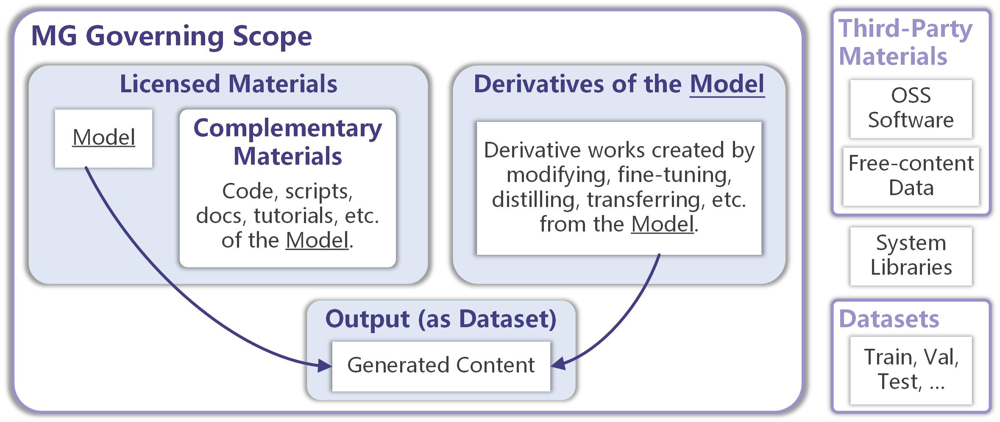

# 📪 FAQ

## Q: Why we need ModelGo licenses?

ModelGo licenses offer flexible options to fulfill your specific licensing needs about using and distributing your deep learning models while protecting your Intellectual Property (IP). Traditional open-source software (OSS) licenses lack clear definitions regarding machine learning concepts, such as Models, Output, and Derivatives created through knowledge transfer. This lack of compatibility can result in certain ML activities (e.g., Distillation, Mix-of-Expert) being beyond the control of the model owner and potentially compromising their IP rights.

Many developers on [HuggingFace](https://huggingface.co/models?license=license:cc-by-nc-nd-4.0\&sort=likes) have chosen to use Creative Commons Licenses (CCs) to restrict commercial use of their models. However, CCs are primarily designed for artifacts such as articles, music, and pictures, making them incompatible when applied to ML models. Therefore, there is a need for a new specific licensing method for models.

Recently, Responsible AI Licenses (RAILs) have been widely advocated to address the need for governing AI technologies, aiming to restrict unlawful and unethical uses of models. We acknowledge the emerging need for such governance (which is why we offer the RAI option in ModelGo licenses), but we also recognize the demand for stricter restrictions, such as prohibiting commercial use, sharing of derivatives, and mandatory open-sourcing to protect the profits of model developers. This is why we propose ModelGo and offer more licensing options to fill this gap.

## Q: What is the difference between ModelGo and OpenRAILs?

From the compositional perspective, OpenRAILs(-M) is built upon Apache-2.0 with additional terms tailored for ML fields. Their main alterations include adding a Use Restrictions attachment and use-based behaviour restriction terms in the license text.  To offer more comprehensive licensing control, ModelGo is not solely based on Apache-2.0 but also draws inspiration or terms from GPL-3.0, CCs, AFL-3.0, Llama2 Community License, SEER License Agreement, and, of course, OpenRAILs.

From a goals perspective, OpenRAILs(-M) advocate for protecting models from unlawful and unethical use. Recently, they provide a [license generator](https://www.licenses.ai/rail-license-generator) to generate a list of domain-specific Use Restrictions. The goals of ModelGo are somewhat different; we aim to provide a CCs-like framework for controlling the use and distribution of published models. For example, developers can freely choose the most permissive licenses like MG0 and MG-BY to waive most restrictions on their models, or they can choose the NC option (which is revocable) to prevent undesired commercialization of their models and generated content. The OS option aims to incentivize sharing and contributions.

Roughly speaking, MG-BY-RAI can be seen as similar to OpenRAILs. But we just leave the RAI as a choice to the model publishers. Additionally, to further deter misuse of models, the patent use rights granted by MG-BY-RAI are revocable, distinguishing it from OpenRAILs.

## Q: What is the scope of ModelGo licenses governing?

MG licenses only apply to the Model, but their terms govern the <mark style="color:purple;">use and distribution of the Model and its derivatives, as well as outputs thereof, and complementary code and scripts</mark>. We classify these objects into three categories to define the scope of terms: Licensed Materials, Derivatives, and Output, each with different restriction terms and using policies. For example, according to the terms of MG-BY-ND, sharing the verbatim copy of Licensed Materials is allowed while sharing any Derivatives and Outputs is prohibited.

MG licenses should not apply to Third-Party Materials (e.g., open-source software and free-content artifacts), system libraries, and datasets (e.g., training set, validation set, test set). This implies that choosing MG with OS does not mandate open-sourcing the data used to develop the model. Due to data privacy concerns and the likelihood that these datasets or the data samples therein already have free-content licenses (typically CCs), we consider datasets to be outside the scope of MG licenses.

<figure><figcaption>
MG Governing Scope
</figcaption></figure>

## Q: May I distribute the generated content?

<mark style="color:purple;">**It depends.**</mark> You can share the generated content (including the output of the Model and the output of the Derivatives of the Model) only if the <mark style="color:purple;">ND option is not being used</mark>. MG licenses will not be proliferated to the generated content and do not claim copyright over them. However, MG licenses require users to acknowledge that the output contains AI-generated content created by the users using the model. Please refer to the "<mark style="color:purple;">The Output You Generate</mark>" section for more information.

## Q: Should I retain the attribution information in the generated content?

<mark style="color:purple;">**No.**</mark> The BY options in MG only apply to the model and its derivatives (excluding code and scripts which may already be covered by separate OSS licenses). MG licenses only require users to acknowledge that the output contains AI-generated content created by the users using the model.

## Q: Revocable vs. Irrevocable;  Sublicensable vs. Non-sublicensable.

Intellectual Property (IP) encompasses patents, copyrights, and trademarks.  Most software, content and model licenses do not confer trademark usage rights, they may or may not provide limited patent or copyright licenses. However, some licenses do not explicitly state whether their granted licenses are revocable or irrevocable, sublicensable or non-sublicensable, leading to ambiguity in work licensing. We summarize this issue in the tables below:

<mark style="color:purple;">**Grant of patent license:**</mark>

<table><thead><tr><th width="331">License Name</th><th width="200">Revocable?</th><th>Sublicensable?</th></tr></thead><tbody><tr><td>Apache-2.0</td><td>No</td><td><mark style="color:orange;">Not Stated</mark></td></tr><tr><td>CodeML-OpenRAIL-M</td><td>No</td><td><mark style="color:orange;">Not Stated</mark></td></tr><tr><td>CreativeML-OpenRAIL-M</td><td>No</td><td><mark style="color:orange;">Not Stated</mark></td></tr><tr><td>GPL-3.0 (Copyleft)</td><td><mark style="color:orange;">Not Stated</mark></td><td>Auto Licensing</td></tr><tr><td>CC-BY-4.0</td><td>N.A.</td><td>N.A.</td></tr><tr><td>Llama License Agreement</td><td><mark style="color:orange;">Not Stated</mark></td><td><mark style="color:orange;">Not Stated</mark></td></tr><tr><td>SEER License Agreement</td><td><mark style="color:orange;">Not Stated</mark></td><td><mark style="color:orange;">Not Stated</mark></td></tr><tr><td>AFL-3.0</td><td><mark style="color:orange;">Not Stated</mark></td><td>Yes</td></tr><tr><td>Llama2 Community License</td><td><mark style="color:orange;">Not Stated</mark></td><td><mark style="color:orange;">Not Stated</mark></td></tr></tbody></table>

<mark style="color:purple;">**Grant of copyright license:**</mark>

<table><thead><tr><th width="331">License Name</th><th width="200">Revocable?</th><th>Sublicensable?</th></tr></thead><tbody><tr><td>Apache-2.0</td><td>No</td><td>Yes</td></tr><tr><td>CodeML-OpenRAIL-M</td><td>No</td><td>Yes</td></tr><tr><td>CreativeML-OpenRAIL-M</td><td>No</td><td>Yes</td></tr><tr><td>GPL-3.0 (Copyleft)</td><td>No</td><td>Auto Licensing</td></tr><tr><td>CC-BY-4.0</td><td>No</td><td>Auto Licensing</td></tr><tr><td>Llama License Agreement</td><td>Yes</td><td>No ✤</td></tr><tr><td>SEER License Agreement</td><td>Yes</td><td>No ✤</td></tr><tr><td>AFL-3.0</td><td><mark style="color:orange;">Not Stated</mark></td><td>Yes</td></tr><tr><td>Llama2 Community License</td><td><mark style="color:orange;">Not Stated</mark></td><td><mark style="color:orange;">Not Stated</mark></td></tr></tbody></table>

NOTE: CC licenses are designed to grant copyright licenses for content, so the granting of patent use is not applicable. <mark style="color:orange;">Not Stated:</mark> a license does not explicitly state its revocability, it is generally understood to be implicitly revocable. ✤: These licenses implicitly include automatic licensing clauses. Auto Licensing means the recipient automatically receives a license from the original licensors whilie sublicensing is not allowed and unnecessary.

ModelGo licenses determine revocability and sublicensing with careful consideration of their target scenarios (see table below). For NC and ND, our aim is to maximize licensee control and ensure all licenses can be revoked. Therefore, we adopt an automated licensing mechanism (with no sublicensor in this case, all licenses will be terminated if the head license is revoked) instead of sublicensing. The exception is OS, we also prioritize protecting the benefits of contributors, making OS licenses irrevocable and [copyleft](https://en.wikipedia.org/wiki/Copyleft). As for other very permissive licenses like MG0 and MG-BY, which encourage sharing and free use, they are irrevocable and allow sublicensing.

<mark style="color:purple;">**Grant of patent and copyright licenses in ModelGo:**</mark>

<table><thead><tr><th width="331">License Name</th><th width="200">Revocable?</th><th>Sublicensable?</th></tr></thead><tbody><tr><td>MG0</td><td>No</td><td>Yes</td></tr><tr><td>MG-BY</td><td>No</td><td>Yes</td></tr><tr><td>CC-BY-OS (Copyleft)</td><td>No</td><td>Yes</td></tr><tr><td>MG-BY-NC-OS (Copyleft)</td><td>No</td><td>Auto Licensing</td></tr><tr><td>CC-BY-RAI</td><td>Yes</td><td>Yes</td></tr><tr><td>MG-BY-NC</td><td>Yes</td><td>Auto Licensing</td></tr><tr><td>MG-BY-ND</td><td>Yes</td><td>Auto Licensing</td></tr><tr><td>MG-BY-NC-ND</td><td>Yes</td><td>Auto Licensing</td></tr><tr><td>MG-BY-NC-RAI</td><td>Yes</td><td>Auto Licensing</td></tr></tbody></table>

ModelGo licenses explicitly state whether they grant or do not grant licensee patent and copyright licenses. This clarity ensures that model users understand their rights and potential risks when reusing and contributing models.

## Q: Are MG licenses with OS considered Open Source licenses?

<mark style="color:purple;">**No.**</mark> ModelGo licenses are not approved by the Open Source Initiative (OSI). However, we aim for MG-BY-OS and MG-BY-NC-OS licenses to keep the model "open." It's also worth mentioning that the meaning of "open" may differ between software and models. In ModelGo licenses, OS means the availability of model weights and specific code and scripts necessary to train and use models, excluding the openness of the dataset (as we consider it outside the governing scope of MG licenses).

## Q: May I close source my models licensed under MG with OS?

<mark style="color:purple;">**No.**</mark> This applies to its derivatives as well. MG-BY-OS and MG-BY-NC-OS are copyleft licenses, meaning all derivative works must also be covered by the same license. You also can't revoke MG-BY-OS and MG-BY-NC-OS, unlike GPL-3.0, which doesn't explicitly claim the granted patent license is irrevocable.

## Q: Will ModelGo licenses support more licensing options?

<mark style="color:purple;">**Possibly**</mark>. We recommend using the licensing options most appropriate for your publishing scenario. We may revise the license text or add new licensing options to address emerging needs in model licensing. However, simplicity and conciseness are also factors we consider, which is important to avoid licensing conflicts in an ML project.

## Q: May I reuse ModelGo licenses text to make my own licenses?

<mark style="color:purple;">**Yes, you can.**</mark> ModelGo licenses explicitly allow you to do so as stated in Section 7, provided that you furnish a readable notice describing your modifications to the original ModelGo licenses. However, we encourage using the licensing options most appropriate for your publishing scenario to facilitate standardization in model licensing and simplify license analysis in ML projects.

## Q: Will my modification to ModelSheet take effect?

<mark style="color:purple;">**No.**</mark> ModelSheet is not part of the terms and conditions of MG licenses, so modifications to it will not be effective. ModelSheet is only to assist you and users in choosing a license and understanding its content. If you have custom needs to add to ModelGo licenses, you should modify the provisions in the terms and conditions part.

## Q: What happens if I remix two models under MG licenses?

There are two scenarios depending on whether the remixed result is <mark style="color:purple;">**separable**</mark> or <mark style="color:purple;">**inseparable**</mark>.&#x20;

In the first scenario, where the two models remain separable from each other, such remixing (for example, Voting, Stacking, MoE, Pipeline, etc.) will not create a brand new work, and the original models will remain under their original licenses. You can apply a new license to your remix effort (e.g., weights of gating networks) if applicable, but this action will not affect the original licenses of the base models.

In the second scenario, where the remixing process results in an inseparable outcome (for example, weight averaging, model fusion, layer concatenation, etc.), it is necessary to check the compatibility between the two original licenses of the base models before remixing. There is a one-way compatibility in MG licenses from Permissive to Conditional to Stringent. This means that the remixing result can be licensed under MG with stricter options, but fewer options are not permitted. We provide you a compatibility table to demonstrate this rule:

<figure><figcaption>
MG Compatibility Table
</figcaption></figure>

Choose two models' licenses you want to remix from the rows and columns. The ✅ mark means you can remix the two models, and there is a feasible licensing solution for relicensing your remix results; ⚠️ mark means due to the terms of NoDerivatives, you can't share your remix results, which leads to you being unable to apply any license to the results; ❌ mark means there isn't a feasible licensing solution for such remixing, so you should follow the terms regarding derivatives of original licenses but can't relicense your remix results.

For example, if we remix two models licensed under MG-BY-NC and MG-BY-OS, respectively, we can relicense the remix results to MG-BY-NC-OS. If we want to remix models with MG-BY and MG-BY-ND, even though it seems feasible to apply MG-BY-ND to the remixing results, following the NoDerivatives terms of MG-BY-ND, we can't share such remixing, which leads to no license being applicable. If we want to remix MG-BY-OS and MG-BY-RAI, the problem is there are no feasible licensing solutions for the remix results, so such remix is not supported by ModelGo licenses.

Overall, in most cases, you can freely remix permissive MG licensed models into your model without conflicts, and remix conditional MG licensed models into your model if following the same restrictions, but it's difficult to remix stringent MG licensed models and impossible to remix MG with ND licensed models.

## Q: Why do ModelGo licenses not support OS with RAI?

Following our previous [ML license analysis study](https://github.com/Xtra-Computing/ModelGo), the copyleft-style use-based restrictions in RAI licenses are incompatible with the terms regarding further restrictions in Section 10 of GPL-3.0. Therefore, with concerns that the RAI kind restrictions are out of the spirit of Open Source and potentially lead to closed source (Ref. Greenbaum, E. (2015). The Non-Discrimination Principle in Open Source Licensing. Cardozo L. Rev., 37, 1297), we didn't draft the MG-BY-OS-RAI license.

> ### GPL-3.0 Section 10
>
> You may not impose any further restrictions on the exercise of the rights granted or affirmed under this License. For example, you may not impose a license fee, royalty, or other charge for exercise of rights granted under this License, and you may not initiate litigation (including a cross-claim or counterclaim in a lawsuit) alleging that any patent claim is infringed by making, using, selling, offering for sale, or importing the Program or any portion of it.

The decision to opt for MG with RAI or not is entirely yours. However, if your project already includes or plans to include any GPL or LGPL code and ML components, it's advisable to avoid RAI licenses. These pose a high risk of leading to license conflicts as long as your project incorporates any RAI components (including generated content and derivatives).
