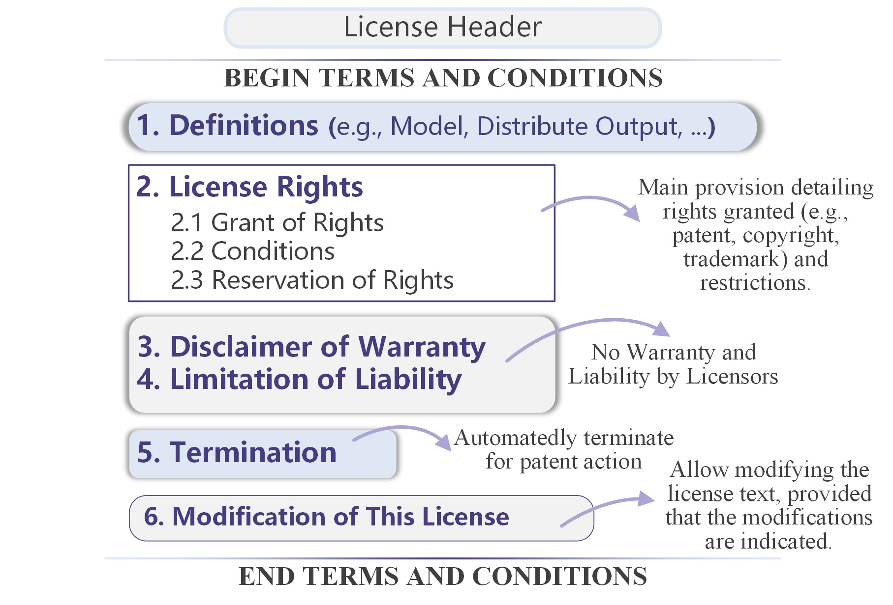

# 📖 Understanding ModelGo

## How It's Built

ModelGo licenses are not starting from scratch; they are a remix of many successful licenses, including <mark style="color:purple;">Apache-2.0, Academic Free License 3.0 (AFL-3.0), GNU General Public License 3.0 (GPL-3.0), Creative Commons Licenses (CCs) and Open Responsible AI Licenses (OpenRAILs)</mark>. In particular, we borrow the definitions of deep learning objects from OpenRAILs, License Elements concepts from CCs, Open Source concepts from GPL, and some patent, copyright, and other legal terms from AFL and Apache. The drafting process of ModelGo also references some proprietary licenses or agreements such as Llama2 Community License, SEER License Agreement, and OpenAI's Terms of Use. However, no verbatim copy of these texts appears in our ModelGo licenses.

Our way of reusing these licenses text is compliant, and to address any copyright concerns, we disclose all referenced licenses' conditions related to reusing their text:



> You may re-use our license unchanged, and also modify it. If you modify it, you are on your own from a legal point of view, and the result is NOT the Apache License, just a new license inspired by ours. This means that the terms 'Apache License', 'Apache', and any similar references to the ASF cannot appear in your modified license, other than to state that it differs from the original. Also, you cannot use 'Apache' in the name of the modified license. Names like "Apache License with such-and-such clause", for example, are not acceptable, as they cause confusion. Creating a new license is a non-trivial task. If you do that we recommend that you get your own legal advice. [\[Source\]](https://www.apache.org/foundation/license-faq.html#mod-license)



> You may modify the text of this License and copy, distribute or communicate your modified version (the "Modified License") and apply it to other original works of authorship subject to the following conditions: (i) You may not indicate in any way that your Modified License is the "Academic Free License" or "AFL" and you may not use those names in the name of your Modified License; (ii) You must replace the notice specified in the first paragraph above with the notice "Licensed under " or with a notice of your own that is not confusingly similar to the notice in this License; and (iii) You may not claim that your original works are open source software unless your Modified License has been approved by Open Source Initiative (OSI) and You comply with its license review and certification process. [\[Source\]](https://opensource.org/license/afl-3-0-php)



> It is possible to make modified versions of the GPL, but it tends to have practical consequences. You can legally use the GPL terms (possibly modified) in another license provided that you call your license by another name and do not include the GPL preamble, and provided you modify the instructions-for-use at the end enough to make it clearly different in wording and not mention GNU (though the actual procedure you describe may be similar). [\[Source\]](https://www.gnu.org/licenses/gpl-faq.en.html#ModifyGPL)



> CC does not assert copyright in the text of its licenses, so you are permitted to modify the text as long as you do not use the CC marks to describe it. However, we do not recommend this. We also advise against [modifying our licenses](https://wiki.creativecommons.org/wiki/Modifying\_the\_CC\_licenses) through indirect means, such as in your terms of service. A modified license very likely will not be compatible with the same CC license (unmodified) applied to other material. This would prevent licensees from using, combining, or remixing content under your customized license with other content under the same or compatible CC licenses. [\[Source\]](https://creativecommons.org/faq/#can-i-change-the-license-terms-or-conditions)



> The BigCode OpenRAIL-M (i.e. the document itself) is licensed under a CC-BY-4.0. You can use it for your models or modify it for your own needs. [\[Source\]](https://www.bigcode-project.org/docs/pages/bigcode-openrail/#can-i-use-the-license-agreement-for-my-own-models)



It's worth mentioning that during the drafting of ModelGo, we discovered that text reuse is common in open software licenses, and it can be difficult to identify <mark style="color:purple;">implicit copying</mark> to text from licenses that forbid reuse. Therefore, there may still be an unknown risk of copyright infringement in ModelGo licenses. Please inform us if you identify these risks or any other similar risks.

## Structure

ModelGo licenses consist of eight sections and one or two attachments. Section 2, "License Rights and Redistribution," is the <mark style="color:purple;">primary provision</mark> that grants patent and copyright licenses and states the restrictions of use and distribution. Two subsections are specific to particular licensing options: "No Derivatives" for "ND" and "Responsible Use of AI" for RAI.

ModelGo licenses include a Disclaimer of Warranty and Limitation of Liability (Section3, 4), and disclaiming any warranty of Third-Party Materials (Section 6). Additionally, our licenses include terms, as  stated in Section 7, that allow you to modify the license text, provided you furnish a readable notice describing your modifications to this license.&#x20;

The attachment, which is separate from the Terms and Conditions of the license, consists of a [Model Sheet](../get-started/how-to-choose.md#with-the-help-of-modelsheet) or, in addition, a list of Use Restrictions. Your custom restriction terms can be added to the Use Restrictions list, but changes made to the Model Sheet will not affect the license content.

<figure><figcaption><p>Structure of MG Licenses</p></figcaption></figure>

## How to Apply the ModelGo Licenses to Your Model

You can use a <mark style="color:purple;">license notice</mark> to declare the use of MG licenses in your model. We recommend attaching this license notice in a separate text file and presenting this information on your model card page or GitHub repository page.

An example of the license notice for MG-BY-NC-RAI is:

```
  Copyright [yyyy] [name of copyright owner]
 
  Licensed under the ModelGo Attribution-NonCommercial-ResponsibleAI License, Version 1.0 (the "License");
  You may not use this file except in compliance with the License.
  You may obtain a copy of the License at
 
  https://raw.githubusercontent.com/Xtra-Computing/ModelGo/main/MG_licenses/MG-BY-NC-RAI.txt
 
  Unless required by applicable law or agreed to in writing, the Licensed Materials and
  any Ouput and results thereof distributed under the License is distributed on an "AS IS" BASIS,
  WITHOUT WARRANTIES OR CONDITIONS OF ANY KIND, either express or implied.
  See the License for the specific language governing permissions and limitations under the License.
```


Please replace the fields enclosed by brackets "\[]" with your own identifying information and change "Attribution-NonCommercial-ResponsibleAI" and "MG-BY-NC-RAI" to the [full name and short identifier](../get-started/using-modelgo-licenses.md#modelgo-licenses-family) of your chosen MG license. If you modify the terms and conditions of MG Licenses, please replace "Version \*" with "Modified Version" and update the license link to your modified license file.


